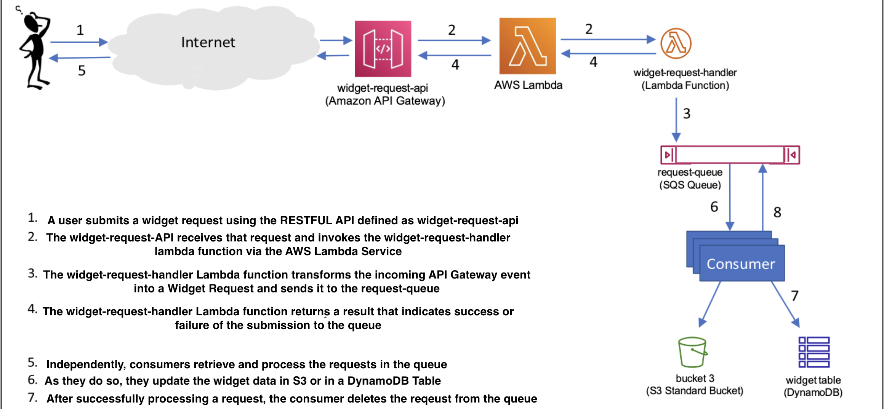

# AWS Widget Requests

The purpose of this project was to gain familiarity with the AWS Ecosystem using a hands-on approach. Widgets were supplied to a lambda function, defined in lambda_function.py, which sent each request into an AWS SQS queue. The consumer process analyzes the data and stores them into an S3 Bucket or a DybamoDB table.

I containerized this image using Docker and Amazon Elastic Container Registry.

## AWS Commands To Know
1. How to connect to EC2 instance:
- `chmod 400 /path/to/your-key.pem`
- `ssh -i /path/to/your-key.pem ec2-user@your-ec2-public-dns`

2. How to send files from local computer to EC2 instance:

- `scp -i /path/to/your-key.pem /path/to/local/file.txt ec2-user@your-ec2-ip-address:/home/ec2-user/`

## Producer vs Consumer

Java files for producer and consumer processes were originally supplied. The lambda_function effectively replaces producer.jar, and consumer.py effectively replaces comsumer.jar. An explanation of what the producer and consumer processes look like are as follows:

1. <b>producer.jar</b>:
- Before the implementation of the lambda function, the producer.jar was responsible for generating widget-related requests. These requests are data structures that instruct how a widget should be created, updated, or deleted.
- Once a request is generated, producer.jar stores this request in an S3 bucket as an object. Each object in S3 has a unique key, which helps identify and retrieve it.
- After storing the request in S3, producer.jar sends a message to an Amazon Simple Queue Service (SQS) queue. This message doesn't contain the full request data. Instead, it contains information (like the S3 object's key) that points to the request stored in the S3 bucket. Essentially, the message in SQS acts as a pointer or reference to the actual request data in S3.
- `java -jar producer.jar --request-bucket=usu-cs5250-green-requests`

2. <b>consumer.py</b>:
- This script runs in a loop, constantly checking the SQS queue for new messages. 
- When it finds a message in the queue, it uses the information in that message to retrieve the corresponding request from the S3 bucket. The RetrieveRequest function handles this by fetching the object (request data) from the S3 bucket using the provided key.
- Once the request is retrieved, the consumer.py script processes it. Depending on the request's instructions, it can:
    - Create a new widget
    - Update an existing widget
    - Delete a widget
- The actual widget data, based on the request's content, can be stored in a different S3 bucket or a DynamoDB table, depending on the specified storage strategy.
- After the request has been processed, the script deletes the message from the SQS queue using the DeleteFromQueue function. It also deletes the request from the S3 bucket using the DeleteRequest function to ensure it doesn't process the same request again.

- How to run consumer.py:
    - --storage-strategy: The storage strategy to use; choose 's3' to store widgets in a bucket or 'dynamodb' to store widgets in a DynamoDB table.
    - --request-destination: The destination where the widgets will be stored; this can be your S3 bucket or DynamoDB table.
    - --request-source (Optional): The S3 bucket where the requests are fetched from. If you select this, you cannot use --queue-url.
    - --queue-url (Optional): The URL of the SQS queue where the requests are queued. If you select this, you cannot use --request-source.
    - Example: `python consumer.py --storage-strategy [s3|dynamodb] --request-destination your_destination_bucket_or_table --queue-url your_sqs_queue_url`

